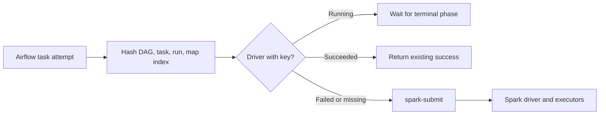

# Airflow Spark Retry Idempotency Demo

A local Minikube project that runs Apache Airflow with the KubernetesExecutor
and submits PySpark jobs in Kubernetes cluster mode. Its custom
`SparkK8sIdempotentOperator` prevents an Airflow retry from blindly launching a
second driver for the same task instance.

> **Status: work in progress.** This is a portfolio demonstration of retry-aware
> orchestration, not an exactly-once production system. The original proof of
> concept was committed in November 2025 and received this reliability and
> security pass in August 2026.

## What it demonstrates

- Airflow 3.2 with KubernetesExecutor on a local cluster
- Spark 3.5 cluster-mode submission from a custom Airflow image
- Stable run-scoped idempotency keys derived from Airflow task context
- Kubernetes labels for driver discovery across Airflow retries
- Reattachment to active drivers and reuse of successful drivers
- Focused RBAC, reproducible Helm values, image checksum verification, and tests



## Retry behavior

The key deliberately excludes Airflow's `try_number`, so retries of one mapped
task instance share an identity while separate DAG runs do not.

| Existing driver state | Operator behavior |
| --- | --- |
| `Pending` or `Running` | Wait for that driver instead of resubmitting |
| `Succeeded` | Return success without another Spark application |
| `Failed` | Allow the Airflow retry to submit a replacement |
| Missing | Submit normally |

The preflight lookup and Spark submission are separate API operations, so two
truly simultaneous attempts could still race before either driver is visible.
Production-grade exactly-once submission would need an atomic Kubernetes Lease
or an external transactional registry in addition to workload-level idempotency.

## Run locally

Requirements: Docker, Minikube, `kubectl`, and Helm 3. The commands below keep
any existing Minikube cluster unless you explicitly remove it.

```bash
minikube start --driver=docker --cpus=4 --memory=8192

kubectl apply -f kubernetes/namespace.yaml
kubectl apply -f kubernetes/spark-rbac.yaml

docker build -t my-airflow:3.2.2-spark -f docker/Dockerfile.airflow .
docker build -t my-spark:3.5.7-job -f docker/Dockerfile.spark .
minikube image load my-airflow:3.2.2-spark
minikube image load my-spark:3.5.7-job

helm repo add apache-airflow https://airflow.apache.org --force-update
export AIRFLOW_ADMIN_PASSWORD='choose-a-local-password'
helm upgrade --install airflow apache-airflow/airflow \
  --version 1.22.0 \
  --namespace airflow \
  --values kubernetes/airflow_helm_values.yaml \
  --set-string createUserJob.defaultUser.password="${AIRFLOW_ADMIN_PASSWORD}" \
  --wait \
  --timeout 10m
```

Optionally smoke-test the Spark image locally before installing Airflow:

```bash
docker run --rm my-spark:3.5.7-job \
  /opt/spark/bin/spark-submit --master 'local[2]' \
  /opt/spark/work-dir/pi.py --iterations 1 --sleep-seconds 0 --records 10000
```

Open a separate terminal and expose the Airflow API/UI:

```bash
kubectl port-forward --namespace airflow service/airflow-api-server 8080:8080
```

Visit <http://localhost:8080>, sign in as `admin`, enable
`spark_idempotency_demo`, and trigger it. The DAG has two Airflow retries so its
retry policy is visible in the graph and task metadata.

Inspect the Spark workload and its run-scoped labels:

```bash
kubectl get pods --namespace airflow -l airflow-idempotency-key
kubectl logs --namespace airflow <driver-pod-name>
```

Remove only this demo release with:

```bash
helm uninstall airflow --namespace airflow
kubectl delete namespace airflow
```

## Test

The unit tests use fake Kubernetes API objects and do not require a cluster.

```bash
python3 -m venv .venv
.venv/bin/pip install -r requirements-dev.txt
.venv/bin/ruff check .
.venv/bin/pytest -q
python3 -m compileall -q dags plugins scripts/pi.py
```

The full integration path additionally requires Minikube because it spans
Airflow, the Kubernetes API, `spark-submit`, the driver pod, and executor pods.

## Security scope

- No Fernet key, API secret, database password, or external Postgres credential
  is committed. Helm creates local dependencies and secrets for the demo.
- The service account can manage only the namespace-scoped pod, pod-log,
  service, and ConfigMap resources Spark needs.
- One service account is shared for local simplicity. Production deployments
  should separate Airflow submission, executor, and Spark driver identities.
